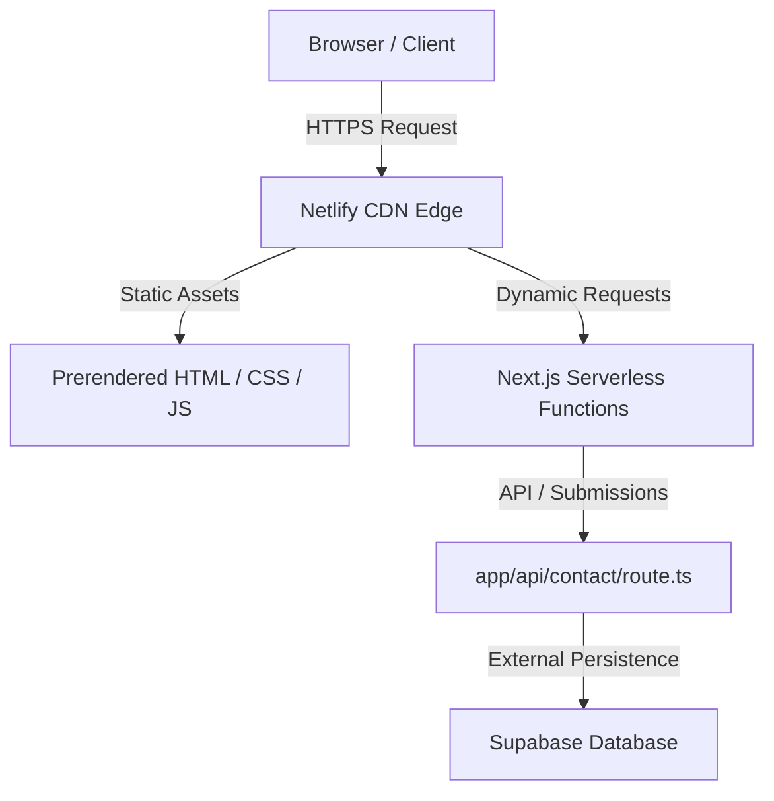

# System Architecture

## Overview

AgencyWeb is designed as a hybrid Serverless Jamstack application leveraging Next.js App Router for hybrid rendering (SSR/SSG/ISR) and Netlify for global CDN edge deployment.

## Architectural Pillars

### 1. Hybrid Rendering Model
- **Static Site Generation (SSG)**: Pre-rendered static pages (`/`, `/services`) for sub-100ms global TTFB.
- **Serverless API Routes**: Thin API functions (`app/api/contact/route.ts`) executed on-demand in isolated serverless execution contexts.

### 2. Styling & Design System
- **Tailwind CSS v4 Engine**: Built on top of `@import "tailwindcss";` and `@theme` blocks inside `app/globals.css`.
- **Zero JS Overhead Styling**: Pure utility classes with CSS custom properties for theme variables (`--color-brand-primary`, `--color-brand-dark`).

### 3. Edge Deployment (Netlify)
- Integrated via `@netlify/plugin-nextjs` to automatically translate Next.js App Router endpoints into Netlify Edge/Serverless functions without cold-start overhead.
