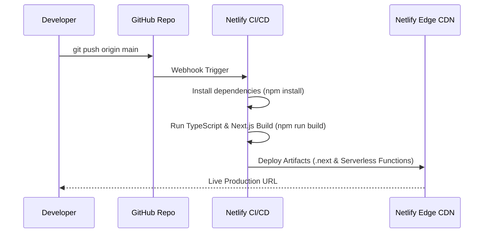

# CI/CD Pipeline & GitOps Workflow

## Overview

AgencyWeb uses a continuous integration and deployment pipeline triggered via Git commits to `github.com/pablo-muela/agencyweb`.

---

## Pipeline Workflow



---

## Quality Gates & Verification

Before code merges into `main`, developers must verify:

1. **Type Checking**:
   ```bash
   npx tsc --noEmit
   ```
2. **ESLint Code Quality**:
   ```bash
   npm run lint
   ```
3. **Production Build Compilation**:
   ```bash
   npm run build
   ```
